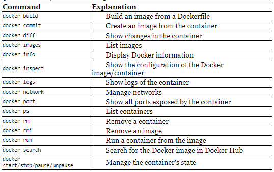

# CI CD
## Continuous Delivery
* common problem: how to release implemented code quickly/safely and sustainably?
* Solution: Continuous Delivery
* automates manual tasks so users receive new features right after implementation

## Traditional Delivery Process
* See image introducing traditional delivery process
* Three phases after requirements: development, quality assurance (tests), operations
* shortcomings: slow delivery (outdated requirements), long feedback cycle (users, developers),
lack of automation (unpredictable releases), risky hotfixes (barely tested), stress (ops, teams), 
poor communication (over the fence --> blaming game), shared responsibility (no team takes it), 
lower job satisfaction

## Benefits of CD
* Goal: change each phase of the traditional delivery process into a sequence of scripts (automated deployment pipeline/CD pipeline)
* Benefits: fast delivery, fast feedback cycle, low-risk releases, flexible release options

# The automated deployment pipeline
* Goal: automate as much as possible of the 3 phases (dev, UAT, Ops)
* Code Change 
--> Continuous Integration (code integrates together) 
--> Automated Acceptance Testing (implemented features meet client's requirements)
--> Configuration Management (configures & deploys software)
* CD Pipeline = sequence of scripts, execute after every committed code change. Success = deploy to production

## Continuous Integration 
* anything fails: pipeline execution stops --> devs fix it
* needs to be fast (not hours!)
* simple to define (is part of development, no agreement with QA/Ops needed)

## Automated Acceptance Testing
* Suite of tests written together with Clients and QAs
* Replaces manual UAT
* Quality gate (is product ready for release?)
* Fail --> Pipeline stops, no release
* Goal: build quality into product, not verify it later
* most difficult to automate: requires client cooperation and creating tests in the beginning (not end)
* What to test and where? Agile testing matrix:
* Acceptance Testing (automated): functional requirements from business view. Stories/Examples written by clients/devs to agree on how the SW should work
* Unit Testing (automated): help devs provide high-quality SW, minimise # bugs
* Exploratory (manual): manual blackbox testing (to break or improve the system)
* Non-functional testing (automated): test performance, scalability, security, etc. 
* Role of a QA in CD: 
* Manual QA:  Exploratory testing
* AUtomation QAs: help with non-functional/acceptance testing (e.g. write code to support load testing)
* no special place, just part of the development team
* Where are integration tests? Somewhere between acceptance/unit tests, more technical than acceptance. 
Implemented as a separate phase in the continuous delivery pipeline
* The testing pyramid
* Higher up: slower
* Acceptance test should *not* show 100% coverage (should be feature-oriented, verify selected scenarios)
* Unit tests: cheap and fast --> strive for 100% coverage

## Configuration Management
* Tracking/controlling changes in SW and its environment
* Prepares/installs tools, scales # of service instances/distribution, infrastructure inventory, deployment tasks 

# Continuous Delivery Prerequisites
## Organisational Prerequisites
* DevOps culture: Team is responsible for dev, QA, and Ops
* Productivity is not lost due to automation of QA/Ops steps
* Starts usually with a team that has 4 devs, 1 op, 1 QA, sitting close together
## Client/Product Owner in the Process
* traditionally: define requirements, answer questions, attend demos, take part in UAT
* CD: no UAT, client writes acceptance tests (need to be more technical)
* Requirements/User Stories can/should have some acceptance tests attached
## Business Decisions
* Business usually sets release schedule
* Feature Toggles/manual pipeline steps may help
* Continuous Deployment: each commit passing tests is deployed
* Continuous Delivery: each commit is a release candidate (release may be manual step)
## Technical & Development Prerequisites
Requirements:
* automated build, test, package, deploy operations: all need to be automatable
* Quick pipeline execution: 5 - 15 mins
* Quick failure recovery
* Zero-downtime deployment: release many times a day, not possible to be down
* Trunk-based development: devs check into master branch regularly (else integration / releases are rare)
* More on process: Continuous Delivery: Reliable Software Releases through Build, Test, and Deployment Automation (Jez Humble/David Farley)
# Building CD Process
## Tools
* Any tool can be replaced by another tool
* Docker: containerisation (package app in env-agnostic image, no server configuration needed)

Docker Hub (registry for docker images)
Docker Compose (tool to define multicontainer Docker apps),
Docker swarm (clustering / scheduling tool)

* Jenkins: automation server for creation of CI/CD pipelines
* Ansible: software provisioning, configuration management, application deployment, docker integration
* Github, Java/Spring Boot/Gradle
* Acceptence Tests: Cucumber/Fitness/JBehave
* DB: Flyway, Liquibase

## Questions
- 3 Phases of traditional Delivery Process: Development, QA, Operations
- 2 Main Stages of CD Pipeline: CI, AAT, Config Management
- 3 Benefits of CD: fast delivery, short feedback cycle, low-risk releases, release options
- Automatable Tests: Unit, Acceptance, Non-Functional
- More Integration or Unit Tests? Unit (faster, cheap)
- DevOps? Dev-QA-Ops, everybody does everything, Mindset
- Software Tools in the Book: Docker (Host, Registry, Image), Jenkins, Gradle, Github, Java, Spring Boot, Kubernetes, Cucumber, Ansible, Flyway

# Creating complete continuous deliver system
* introducing docker - Docker Host \[Containerized Application\] (access app as if it ran directly on the host machine (through port forwarding/publishing (Docker)))
* configuring Jenkins - Jenkins Master accepts build request, execution is started on one of the Jenkins Slave (agent) machines
* CI Pipeline  - commit stage: every commit to github triggers the jenkins build --> compile/unit tests/code coverage, static analysis, etc --> notification to devs
* Automated acceptance testing - merges docker & Jenkins w/ automated acceptance testing (aat) in Cucumber (docker registry (repo for docker image), docker host (pulls app from registry and starts it for aat))
* Clustering w/ Kuberentes - 1 Docker Host replaced with Kubernetes Cluster, 1 standalone app replaced with two dependent containerized apps
* Configuration Management w/ Ansible - multiple environments w/ Ansible (Testing/ Staging / Prod), deployment of the same app (kubernetes cluster) on multiple machines
* CD Pipeline/advanced CD - deploy app to prod env w/ many instances & automatic db schema management w/ Flyway migrations

# Docker
## Questions
* main difference between containerization (docker) and virtualization (virtualbox)?
* No Guest OS in containers. Dependencies still managed per container, not shared through Host OS
* benefits of providing app as Docker image (min. 2)?
* higher performance, smaller resource consumption, smaller images
* Environment, Isolation, Application Organisation, Portability
* Can Docker Deamon be run natively on Windows/macOs?
* No, uses Virtual Machine
* Difference between Docker image and Container?
* like class and object: image = describes app, container = an instance of image
* What does it mean that docker images have layers?
* Each layer adds an image, e.g. base image is ubuntu, above an image git, above an image jdk, etc.
* 2 Methods to create docker image?
* commit and Dockerfile
* command to create docker image from Dockerfile?
* docker build -t {new_image_name} .
* command to run docker container from docker image?
* docker run -t <image_name>
* what is "publishing a port"?
* Make app accessible to/from outside
* what is a docker volume?
* a mounted volume from the host os that is mapped to a volume in the container. Can be used to persist files and other data.

## What is Docker?
Docker containers wrap a piece of SW in a complete filesystem that contains everything to run: code, 
runtime, system tools, system libraries  anything can be installed on a server. This guarantees that the software
will always run the same regardless of its environment
* packaging an app into an image and run it anywhere (similar to virtualisation)

## Containerization vs. Virtualization
* Virtualisation: Virtual Machines (VirtualBox etc.): like physical machine ( see Pic ), with OS
* Drawbacks: low performance, high resource consumption, large image size
* Containerisation: NO OS, Apps directly interface with Host OS, no Guest OS: better performance, no waste of resources, smaller images
* Each container has own libraries in right version, no interdependencies between containers

## Docker for Ubuntu
page 39
## Docker images & containers
image = stateless collection of all files necessary to run an app with the recipe of how to run it
container = stateful instance of an image. N containers per 1 Image possible, state changes possible to container
Base image = usually OS, build images on top of it (e.g. ubuntu base image, add git image, add jdk image, etc.)
--> container on top is able to download java project from github and compile & run a jar file
Docker Hub: contains lots of images, official image usually the one without prefixes

#Building images
- real power of docker: building own docker images that wrap the program together with its environment
* Built in language to specify instructions to be executed to build docker image: Dockerfile

## Commands
### Committing image from container from commandline
* *docker run -i (interactive) -t ubuntu:18.04 /bin/bash* # runs ubuntu cmd --> can apt-get install things like java
* docker commit {docker-container-hash} {name-of-new-docker-image} # creates a new docker image based on a configured container
* docker container ls -a # list all docker containers (running and old)

### Committing image from Dockerfile from cmd
* Windows cmd new file: type nul > file-name.file-ending
* Windows cmd edit file: notepad filename
* Add FROM ubuntu:18.04 RUN apt-get update && apt-get install -y git && apt-get install -y openjdk-11-jdk
* FROM: on top of which image to build an image from
* RUN: specifies commands to run _inside_ the container
* COPY: copies files/directory into filesystem of an image (from host to container, needs (.) at the end?)
* ENTRYPOINT: defines which app should be run in the executable container
* docker build -t {new_image_name} . # inside the Dockerfile containing directory, dot (.) needed at the end!

## Environment Variables:
* Either inside Dockerfile "ENV {Env-Name} {Value}" (ENV NAME Oliver) or
* As parameter in docker run -e NAME=Oliver hello_world_java
--> Env in Parameter overrides Env in Dockerfile!

## Docker container states
Apps that should run continuously: run in background: add -d (--detach) option to run
* docker run -d -t ubuntu:18.04
* print running containers: docker ps
* print all containers: docker ps a
* Container states: exited, paused, restarting, and running
* Don't pause... it freezes the processes with SIGSTOP signal
* docker stop {container-hash}

# Docker Networking
* run a service and expose its ports to other apps

## Running Services 
* docker run -d tomcat (access at port 8080, but its inside the container)
* logs from -d services: docker logs {container hash}
* access through publishing (port mapping): docker run -p (--publish) <host_port (external)>:<container_port (internal)>

## Container Networks
* docker inspect {container hash}: prints container configuration as json --> NetworkSettings
* Formatting parts: docker inspect 6de480776ea8 -f '{{.NetworkSettings.IPAddress}}'
* Gateway: host ip address with which container communicates, IpAddress = container IP Address => does not even need port forwarding
* By default containers don't open routes from external systems

--> change with --network (-n) flag
* bridge (default): Network through default Docker bridge: define which ports are published
* none: Not Network: cant connect to the server and vice versa
* container: Network joined with the other (specified) container
* host: Host's network stack (container's network interface is identical to host, same IP addresses, everything on container is visible outside)
* NETWORK: User created network (using docker network create command)
* List networks: docker network ls

## Exposing Container Ports
* EXPOSE 8080 in the Dockerfile: not published, but informs user which ports to publish

### Automatic Port Assignments
* Publish container port to an unused host port: -p <container_port>
* Publish all exposed container ports to the unused host ports: -P (--publish-all)

## Persistence: Using Docker Volumnes
* DB as a container: where is data stored? not in the container
* Docker Volumne == Docker's host's directory mounted inside container
--> container can write to host's filesystem as if it was its own \[Docker container \[container drive\]---\]--Volumne--->\[host drive\]
* Volumes clearly separate processing from data
* Volume specification: -v <host_path>:<container_path>
* docker run -i -t -v <h>:<c> ubuntu:18.04 /bin/bash
* or as instruction in the docker file: VOLUME /host_directory

# Naming Containers
* Naming Containers: Convenience & Possibility to Automate
* docker run -d --name tomcat tomcat

# Tagging Images
* -t is a tag --> -t <image_name> --> -t hello_world_python
* An image can have multiple tags
* Naming convention: <registry_address>/<image_name>:<version>
* registry address: IP and port of the registry or the alias name
* image_name: name of the image, e.g. ubuntu
* version: version of the image, e.g 18.04

# Docker cleanup
## Cleaning up containers
* check all containers: docker ps -a
* delete stopped containers: docker rm
* stop containers: docker stop <hash/name>
* remove all stopped containers: docker rm $(docker ps --no-trunc -aq) (only on ubuntu)
* Specify on start up that container should be removed once it finished: docker run -rm hello-world

## Cleaning up images
* check all images: docker images
* remove an image: docker rmi <image_hash>
* Set up cron job that executes: docker rmi $(docker images -q)
* Don't remove images with tags: dangling parameter: docker rmi $(docker images -f "dangling=true" -q)

#Docker Commands Overview


#Jenkins
docker run -p 6666:8080 -v C:\\\\Users\\olzi\\docker\\jenkins:/var/jenkins_home --name jenkins  jenkins/jenkins:2.150.3 2.150.3

# Master
* one master that gets more performant as required (vertical scaling) or multiple (even one master per team, horizontal scaling)
* manages build environment (slaves), receives http requests, build triggers, and sends out notifications

# Test and production envs
* always have two jenkins instances test and production that barely differ, to test some new plugins etc. on test

# Ways of communication between slaves/master
* SSH protocol or a specific Java program for communications inside firewall

# Slaves/Agents
* Able to execute a build
* better generic than specific

# Setting agents
How to attach slaves to masters? 
* static vs dynamic: fix number of slaves assigned to master vs number varies as needed (better)
* specific vs general-purpose: e.g. can only run Java 7 vs docker host with pipeline inside docker container

This leads to 4 configuration possibilities:

# No Scaling Solutions
## Permanent agents: permanently add specific agent nodes.
manage jenkins > manage nodes > new node
* name: unique agent name
* description: human readable description
* \# number of executors: \# of concurrent builds that can be run on the slave
* remote root directory: dedicated directory on slave machine the agent can use to run build jobs (e.g. /var/jenkins). Not critical as most important data is sent back to master
* Labels: tags to match specific builds (e.g. Java 8 builds, AAT builds)
* Usage: agent should be used for matched labels or any builds
* launch method: 
       
       via Java Web Start (agent establishes connection), 
       via execution of command on the master (starts slave, ssh <slave_hostname> java -jar ~/bin/slave.jar)
       via ssh (master connects to the slave via ssh protocol)

* Availablity: should agent be up all the time or master can turn it off?

Update # executors on master to 0 so it does not execute any builds and only serves as UI and coordinator

* Problem: no virtualisation: each slave can only handle a certain type of build (specified by the label)

## Permanent Docker Agents
* Only difference to before: each slave machine needs Docker
* Define the docker image in each pipeline:
```groovy
pipeline {
    agent {
        docker {
            image 'openjdk:8-jdk-alpine'
        }   
    }
}
```
--> Jenkins slave _starts container_ from image, then executes pipeline steps _inside_ this container
----> No need to configure slaves separately depending on the project type
* no slave label needed, just define appropriate docker image in pipeline script

# Scaling Solutions
## Jenkins swarm agents
Manage Jenkins > manage plugins > install \"self-organizing swarm plug-in modules\"
* run swarm-client.jar on every jenkins slave (get it from the jenkins plugin side)
* attach it as follows:
```text
java -jar swarm-client.jar 
-master <jenkins_master_url> 
-username <jenkins_master_user> 
-password <jenkins_master_password>
- name jenkins-swarm-slave-1 
```

* can also be configured using a Docker images
* dynamic scalling w/ Kubernetes or Docker Swarm possible

## Dynamically Provisioned Docker Agents
* Dynamically create new agent each time a build is started 
* most flexible solution (number of slaves adjusts to number of builds dynamically)

### Configure as follows
* install docker plugin, then
1. Open manage jenkins
2. click "configure system"
3. go to cloud section
4. click "add new cloud" > choose docker
5. Fill in docker agent details
6. at least Docker host URL needs to be set (address of the docker host machine where agents will be run)
7. docker agent templates > select docker template > fill in slave details 
* docker image: evarga/jenkins-slave (for java 8 apps)
* instance capa: max # of agents running at the same time (max 10)

## How does it work?
1. job starts > master runs new container of jenkins-slave image on slave docker host
2. jenkins-slave has Ubuntu image with sshd server installed
3. jenkins master adds agent to agent list
4. agent is accessed with ssh communication to perform the build
5. after build master stops and removes slave container

Advantages:
* Automatic agent life cycle (create, add, delete is automated)
* scalability (slave docker host could be cluster composed of multiple machines, no jenkins changes)

# Custom Jenkins images

## Building Jenkins Slave
* Env adjusted to the project to build --> any library, tool, testing framework needed by the project
4 Steps:
1. Create Dockerfile
2. Build image
3. Push image to registry
4. change agent config on master

* Build on top of existing evarga/jenkins-slave (dynamically provisioned docker agent) image e.g.
1. Dockerfile
```
FROM everga/jenkins-slave
RUN apt-get update && apt-get install -y python
```
2. Build image
```
docker build -t [dockerhub-name]/jenkins-slave-python .
```
3. Push image to registry
```
docker push [dockerhub-name]/jenkins-slave-python (needs account on docker hub)
```
4. Change agent config on master: from evarga/jenkins-slave to \[dockerhub-name\]/jenkins-slave-python (needs credentials in master if its a private dockerhub image)

## Building Jenkins Master
* e.g., when you want a base master image for horizontal scaling that each team can use to build its own master from

* how? add groovy script to docker file to manipulate Jenkins config

--> manipulates config.xml

1. Groovy script 'executors.groovy'
```Groovy
import jenkins.model.*
Jenkins.instance.setNumExecutors(5) //Jenkins api: http://javadoc.jenkins.io/
```
2. Dockerfile
``` text
FROM jenkins/jenkins:2.150.3
COPY executors.groovy /user/share/jenkins/ref/init.groovy.d/executors.groovy
RUN /usr/local/bin/install-plugin.sh docker-plugin
```
3. Build image
``` text
docker build -t [dockerhub-name]/jenkins-master .
```

(4. Push to registry (optional))
``` text
docker push [dockerhub-name]/jenkins-maste
```

# Backup: use plugins

# Acceptance Testing
AAT specifics:
* User-facing (written with user --> understanding of tech/nontech needed)
* Dependencies Integration (complete system to test if all works fine together)
* Staging environment (same env as prod for tests!)
* App Identity (same binary run everywhere --> no risk of different building envs --> e.g. build docker image once and distribute (store, version) it through docker registry)
* Relevance and Consequences (an accepted App should be ready for release from user perspective)

# Docker Registry
* Stores Docker images (publish & retrieve images) == artifact repository

# Artifact Repository
* Most popular: JFrog Artifactory, Sonatype Nexus
* guarantees that same binary is used throughout all pipeline steps

# Setting up private repo
* see location 2608

# Pushing an image
* <registry_address>/<image_name>:<tag>
* registry_address: username for dockerhub, domain name/ip address with port for private registry
* tag: image/app version
* Access restricted repo: docker login --username <username> --password <password>

# Pulling the image
* docker pull ozihler/ubuntu_with_python:1

# Run jenkins with mounted volume for jenkins_home
```
docker run --privileged -p 33333:8080 -v C:\Users\olzi\docker\dockerregistry\buildimage\jenkins_home:/var/jenkins_home jenkins/jenkins:2.150.3
```

# Adding Docker File
* Dockerfile
```
FROM openjdk:8-jre
COPY build/libs/calculator-0.0.1-SNAPSHOT.jar app.jar
ENTRYPOINT ["java", "-jar", "app.jar"]
```

* Build app:
```
gradlew build
docker build -t calculator .
docker run -p 8080:8080 --name calculator calculator
```
* access to docker.sock of host
https://www.digitalocean.com/community/questions/how-to-fix-docker-got-permission-denied-while-trying-to-connect-to-the-docker-daemon-socket

https://stackoverflow.com/questions/51342810/how-to-fix-dial-unix-var-run-docker-sock-connect-permission-denied-when-gro

* Got permission denied while trying to connect to the Docker daemon socket at unix:///var/run/docker.sock: Get http://%2Fvar%2Frun%2Fdocker.sock/v1.40/containers/json: dial unix /var/run/docker.sock: connect: permission denied
```
sudo groupadd docker
sudo usermod -aG docker $USER
sudo setfacl -m user:ozihler:rw /var/run/docker.sock
```
* Install more on jenkins docker: https://github.com/jenkinsci/docker#installing-more-tools

* script.sh docker not found ?
```
docker run --name jenkins -p 8080:8080 -p 50000:50000
-v /var/run/docker.sock:/var/run/docker.sock
-v $(which docker):/usr/bin/docker
-v /home/jenkins_home:/var/jenkins_home
jenkins/jenkins

sudo docker run --rm -ti --privileged -p 8090:8080 -p 50000:50000 -v /var/run/docker.sock:/var/run/docker.sock -v $(which docker):/usr/bin/docker -v /var/jenkins_home:/var/jenkins_home --user root jenkins/jenkins:jdk11
docker-master

```
```
pwd # print current directory
```
Log into synology:
```
putty > IP address of nas, port 22 > type in username/pw
```

